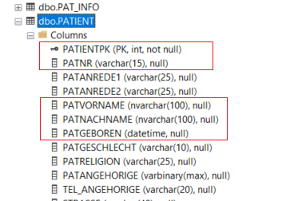
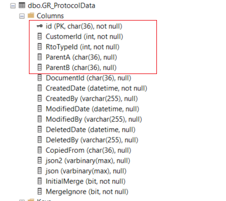

# SQL-Statements

## Tabelle: Patient

- Die Tabelle beinhaltet Partientenstammdaten

- **Aufgabe 1** - Schreiben Sie ein SQL für alle Patienten die „Schulz", „Schultz" oder „Schulze" heißen zurückliefert.
- **Aufgabe 2** - Schreiben Sie ein SQL das ausgibt zu welchem Geschlecht, es wieviele Patienten gibt.

## Tabelle: gr_protocoldata

- Die Tabelle beinhaltet anamnestische Informationen in Form eines     JSON Dokumentes
- Dokumente sind einer Art zugewiesen RtoTypeId (1 = Anamnese, ..., 42    = Biography, .. usw.)
- ParentA und ParentB sind die Vorgängerdokumente
- Das Aktuelleste Dokument hat keine Nachfolger-Dokumente

- **Aufgabe 1** - Schreiben Sie ein SQL, dass alle Dokumente des Types RtoTypeId = 1 liefert.
- **Aufgabe 2** - Schreiben Sie ein SQL, dass zu jeder CustomerId das aktuelleste Dokument von RtoTypeId = 1 liefert.
