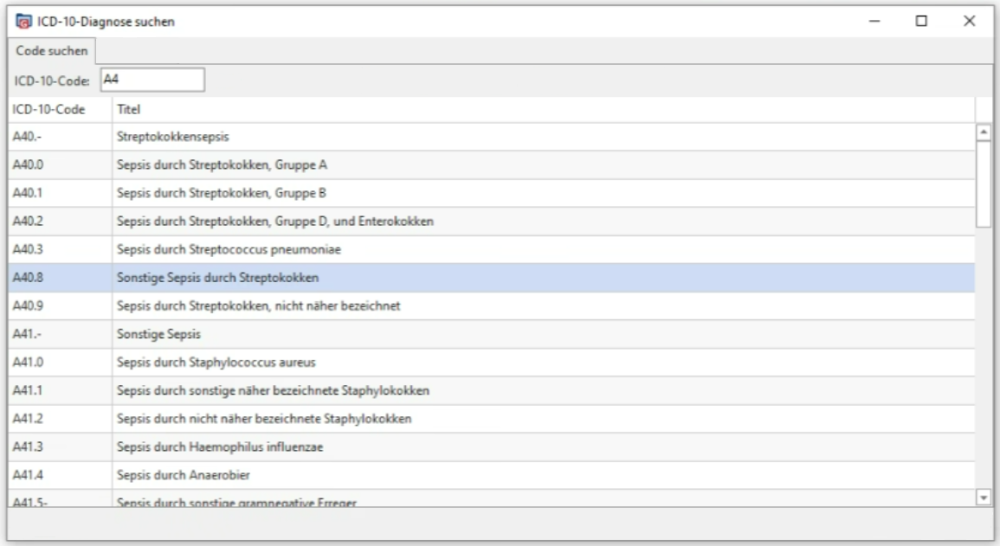

# Werkstudent Web-Entwicklung

Zunächst einmal Glückwunsch: Wenn du das hier liest, hast du es wahrscheinlich
in die nähere Auswahl als Werkstudent bei RECOM geschafft! (Ich erdreiste mir
mal das Du.) Oder du bist einfach so hierauf gestolpert - dafür auch Glückwunsch
:)

Die folgende Aufgabenstellung sollst du alleine auf deinem Rechner nach bestem
Wissen und gewissen lösen. Wir werden dann deine Lösung zusammen besprechen und
du kannst uns erklären, wieso du welche Entscheidungen dabei getroffen
hast. Dabei geht es uns nicht darum, Kenntnis von bestimmtem Technologien
abzufragen. Unser Ziel ist es, deinen Kenntnisstand zur Web-Entwicklung
im Allgemeinen zu verstehen.

# Aufgabe 1: ICD-10 Suchmaske

Wir möchten dir eine Aufgabe aus unserem Fachbereich stellen: Du sollst eine
einfache web-basierte Suchmaske für ICD-10-Diagnosen schreiben.

[ICD-10][ICD10] ist eine standardisierte Sammlung von Diagnosen. Jede Diagnose
hat einen *Code*, der sie eindeutig identifiziert. Zum Beispiel: Der Code
`A40.8` zeigt auf die Diagnose "Sonstige Sepsis durch Streptokokken". Außerdem
sind ICD-10 Diagnosen in einer Baumstruktur sortiert. Für diese Aufgabe sollst
du die Baumstruktur der Einfachheit halber *ignorieren*. 

Hier also ein Screenshot von dem Werkzeug, dass du bauen sollst:



Bei der Eingabe im Suchfeld soll die Liste der Diagnosen darunter gefiltert werden.

[ICD10]: https://www.bfarm.de/DE/Kodiersysteme/Klassifikationen/ICD/ICD-10-GM/_node.html
[IDC10Download]: https://www.bfarm.de/SharedDocs/Downloads/DE/Kodiersysteme/klassifikationen/icd-10-gm/version2025/icd10gm2025syst-meta_zip.html?nn=841246&cms_dlConfirm=true&cms_calledFromDoc=841246

## Zur Implementierung

Alle ICD-10 Diagnosen lassen sich als .csv-Datei
[herunterladen][IDC10Download]. Die .zip-Datei enthält eine ausführliche README,
die du dir natürlich gerne durchlesen kannst - musst du aber auch nicht:
Relevant für uns ist nur die Datei
`Klassifikationsdateien/icd10gm2025syst_kodes.csv` und daraus die Spalten 6
(Eindeutiger Code) und 9 (Titel der Diagnose).

Wie gesagt, wir möchten dir keine speziellen Technologien vorschreiben. Ein paar
Randbedingungen gibt es aber schon:

1. Das Projekt soll "Full-Stack" sein, d.h. du sollst ein Backend *und* ein
   Frontend schreiben.
2. Verwende als Datenspeicher eine relationale Datenbank.
3. Verwende im Frontend ein Framework deiner Wahl. Du kannst dir Aussuchen, ob
   es Angular, React, Solid, Svelte sein soll. JavaScript ohne Framework oder
   nur mit JQuery zählt nicht.
4. Das Backend überlassen wir dir komplett. Wenn du noch nicht viel Erfahrung im
   Backend hast, können wir dir z.B: [express.js][expressjs] empfehlen. Aber
   wenn du mehr Lust auf ASP.NET, PHP oder [Rockstar][rockstarlang] hast dann
   ist das dir überlassen.
5. Das Frontend sollte /halbwegs/ nach etwas aussehen. Du brauchst dich nicht zu
   verkünsteln, aber etwas CSS oder z.B. eine Material Design Library würden wir
   uns doch wünschen.

[expressjs]: https://expressjs.com/en/starter/hello-world.html
[rockstarlang]: https://codewithrockstar.com

# Aufgabe 2: Umzug der Datenbank

Die relationale Datenbank aus Aufgabe 1 sollst du jetzt auf irgendeinen anderen
"Server" umziehen. Das kann eine VM, ein Docker oder LXC Container oder sogar
eine physische Maschine sein - wie du möchtest. Ob das auf Linux / Windows
Server / BSD / Haiku oder TempleOS läuft ist auch deine Entscheidung.

Wichtig ist nur: Die Anwendung muss immer noch mit der Datenbank reden können.

# Aufgabe 3: Code

Notiere dir zu den nächsten Aufgaben einfach deine Gedanken und Code, den du für
sinnvoll hältst, auf. (Javascript/Typescript ist keine Vorgabe, benutze die
Sprache die du willst.)

## Algorithmen

```typescript
/**
   Returns the first non-repeating character in the given string {@see
   value}. If all characters are repeating, returns false.

   @param {string} value - Any non-empty string of lowercase english letters 
     (a,b,c,...,y,z). No digits, special characters, uppercase, etc.

   @example
   Find("abc") = 'a'            // all characters are non-repeating, 'a' is the first
   Find("aaabccccdeeeef") = 'b' // b, d, f are non-repeating, 'b' is the first
   Find("abcabcabc") = '_'      // all characters are repeating
   
   Tasks/Questions:
   - Implement the Algorithms
   - What is the time complexity?
 */
function firstNonRepeatingCharacter(value: string): string | false {
  return false;
}
```

## Refactoring

```typescript
import { FancyWebClient, FancyMailSender, FancyMessageBox } from 'somewhere-else';

/**
      Gegeben ist dieser NewFileInspector. Wenn eine neue Datei in einem
      bestimmten Verzeichnis angelegt wird, soll er den User informieren. Dafür
      gibt es eine Menge von Verhalten die an oder ausgeschaltet werden können.
      
      Die Benutzung ist so gedacht:
      
      const ic = new NewFileInspector('/temp');
      ic.shouldCallWebservice = true;
      ic.start();
       
      Welche Probleme ergeben sich hinsichtlich der Wiederverwertbarkeit,
      Wartung und Erweiterbarkeit?  Wie könnte ein Refactoring aussehen?
 */
class NewFileInspector {
  private #looping: boolean;
  private #listenToDirectory: string;

  public shouldCallWebservice: boolean;
  public shouldSendEmail: boolean;
  public shouldShowMessageBox: boolean;

  constructor(listenToDirectory: string) {
    this.#listenToDirectory = listenToDirectory;
  }

  start(): void {
    this.#looping = true;

    while (this.#looping) {
      const newFile     = true;        // Platzhalter für eine Abfrage
      const newFileName = "text1.txt"; // Platzhalter für eine Abfrage

      if (newFile) this.executeBehaviour(newFileName);

      // Schlafe für 1s
      await new Promise(resolve => setTimeout(resolve, 1000));
    }
  }

  stop(): void {
    this.#looping = false;
  }

  private executeBehaviour(newFileName: string): void {
    if (this.shouldCallWebservice) 
      FancyWebClient.Request(`http://some.where?file=${newFileName}`);
    if (this.shouldSendEmail) 
      FancyMailSender.Send('me@recom.eu', `New File ${newFileName} detected!`);
    if (this.shouldShowMessageBox) 
      FancyMessageBox.Show(`New File ${newFileName} detected!`);
  }
}
```